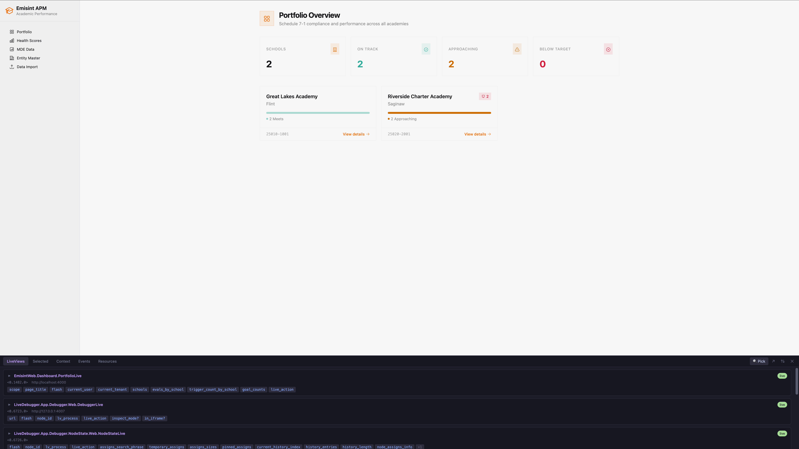
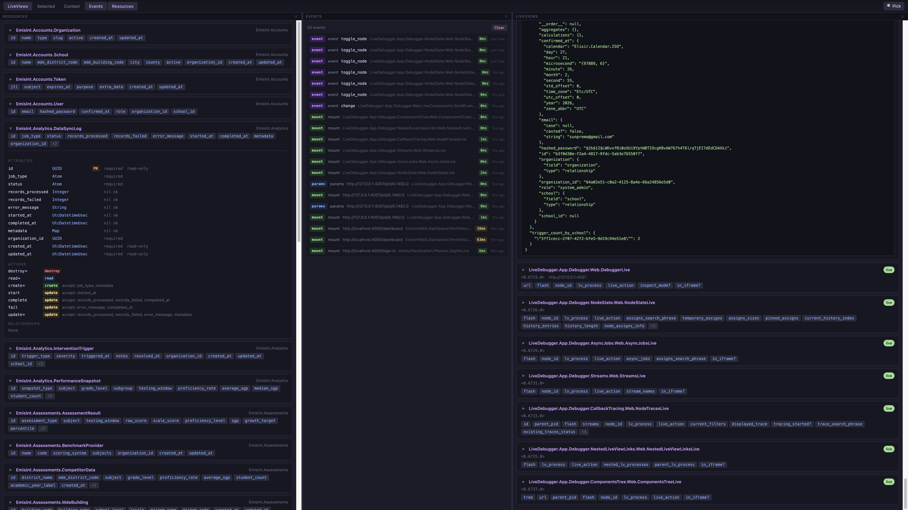

# LiveAgent

An MCP (Model Context Protocol) server plug for Phoenix LiveView that exposes your socket assigns and browser context to AI coding tools like **Claude Code**.

Think of it as `live_debugger` but as an MCP server — giving Claude Code live read access to what's currently rendered on your screen, including a built-in browser panel for picking elements and sharing context.

---

## Screenshots

**Inline panel** — docked to the bottom of your app, showing active LiveViews and their assigns:



**Standalone view** — open in a new tab with multiple panels visible at once (LiveViews, Resources, and Events side by side):



---

## What it does

### In-browser panel

LiveAgent auto-injects a **bottom panel** into every page of your app (dev only). Click the **⚡ LA** button in the bottom-right corner to open it.

The panel has seven panels, each toggled independently from the launcher bar — open as many as you want side by side:

| Panel         | What it shows                                                                              |
| ------------- | ------------------------------------------------------------------------------------------ |
| **LiveViews** | All active LiveView processes — click `▶` to expand assigns inline                         |
| **Selected**  | The DOM element you picked with the element picker, with component resolution              |
| **Context**   | The element you pinned for Claude to read                                                  |
| **Events**    | Live log of `handle_event`, `mount`, `handle_params`, and `handle_info` calls              |
| **Timeline**  | Ordered list of assigns transitions per LiveView — trigger, diff counts, click to expand   |
| **Async**     | In-flight `start_async` / `assign_async` tasks with live elapsed time, plus a completion history per LiveView |
| **Resources** | All Ash resources — click `▶` to expand attributes, actions, and relationships             |

Click any panel button in the top bar to open or close it. Drag the divider between open panels to resize them. Click **↗** to open the whole panel in a new tab.

The top-right of the bar also has the **Drive** toggle and the **agent control status dot** — when an open panel is connected, Claude can highlight elements and (with Drive on) click, fill, submit, and navigate. See the [Agent controls](#agent-controls) section below.

**Element picker** — click **🔍 Pick**, then click any element on the page. LiveAgent captures its HTML, CSS classes, and Phoenix attributes (`phx-click`, `data-phx-component`, etc.). If the element belongs to a LiveComponent, the **Selected** panel automatically shows the component module, its `id`, and its current assign keys — resolved directly from the running BEAM process. Click **📋 Pin to Claude Context** to make it available to Claude via MCP.

**Resources tab** — lists every Ash resource loaded in the running app. Click `▶` on any resource to expand a full breakdown: attributes with types and constraints, actions with their accepted fields and arguments, relationships with destination resources, and any calculations or aggregates. Loaded once when the tab is first opened. Requires Ash to be installed — the tab is still shown but displays a message if Ash is not available.

**Events tab** — shows a scrolling log of LiveView telemetry events as they happen. Each row displays the event type, event name (for `handle_event`), the LiveView or LiveComponent that handled it, duration, and how long ago it occurred. Click any row to expand the params or error details. Duration is color-coded: green under 10ms, amber 10–100ms, red over 100ms. Exceptions are highlighted in red. The log holds the last 200 events and can be cleared with the Clear button.

**Timeline tab** — groups recent assigns *transitions* by LiveView, newest first. Each row shows the trigger (`mount` / `handle_event` / `handle_params` / `live_component_event` / `handle_async` / `unknown`), the diff counts (`N changed, M added, K removed`), and the duration. Click any row to expand the full diff with `before`/`after` values. Unknown rows mean a render happened without a matching callback telemetry — almost always a `handle_info` (PubSub, `send_after`, etc.) since Phoenix doesn't emit telemetry for `handle_info`. (`handle_async` entries also start as "unknown" and are relabelled by the Async inspector when it sees the matching task exit.) Up to 50 entries per LiveView are kept in memory; processes that exit are dropped after a 60s grace period.

**Async tab** — per LiveView, three sections:
- **In flight** — tasks currently running, with the registry kind (`start` / `assign` / `stream`), task pid, and a live-updating elapsed time.
- **AsyncResult assigns** — every assign holding a `%Phoenix.LiveView.AsyncResult{}`, with its `loading` / `ok?` / `failed` state.
- **History** — completed tasks newest first, with duration, success/exit status, and a `→ timeline #N` link to the corresponding entry in the Timeline pane.

Up to 25 history entries per LiveView are kept; the inspector polls `socket.private[:live_async]` every 250ms while the tab is open, so tasks that finish in under one tick may not appear in history (we still catch them in `AsyncResult assigns` if they were launched with `assign_async`).

### MCP tools

Claude Code can call these tools while you work:

| Tool                    | Description                                                                     |
| ----------------------- | ------------------------------------------------------------------------------- |
| `list_live_views`       | Lists all active LiveView processes (PID, view module, assign keys)             |
| `get_assigns`           | Returns the full assigns map for a LiveView — the live data on screen           |
| `get_assign`            | Returns a single assign value by key                                            |
| `get_socket_info`       | Returns full socket metadata (view, IDs, transport, assigns)                    |
| `get_state_history`     | Recent assigns transitions for a LiveView — trigger, diff, duration, exception. Answers "why did X change?" without re-running the flow. |
| `get_state_event`       | Full diff for one timeline entry by id (drill into `get_state_history` results) |
| `list_async_tasks`      | "What's loading right now" for a LiveView — pending `start_async`/`assign_async` tasks and any `%AsyncResult{}` values in assigns |
| `get_async_history`     | Recent completed async tasks for a LiveView with duration, result, and a cross-link to the state timeline |
| `get_async_event`       | Single async history entry by id                                                |
| `watch_assigns`         | Snapshot assigns at this moment (call repeatedly to track changes)              |
| `get_selected_element`  | Returns the element most recently picked in the browser panel                   |
| `get_pinned_context`    | Returns the element the user explicitly pinned for Claude                       |
| `get_component_tree`    | LiveComponent tree for the current page — modules, ids, assign keys, events, forms (id + phx-submit/phx-change), named inputs, and buttons with their text and phx-click. Use this before calling `click`/`fill`/`submit` to pick the right target. |
| `list_ash_resources`    | Lists all Ash resources with attributes, actions, and relationships (Ash only)  |
| `get_ash_resource_info` | Full introspection of a single Ash resource — types, constraints, actions, etc. |
| `highlight_element`     | Draws a Chrome DevTools-style overlay on an element in the user's browser (by cid / CSS selector / visible text). Requires the panel to be open. |
| `clear_highlight`       | Removes any active highlight overlay                                            |
| `click`                 | Clicks an element in the user's browser (by cid / selector / text). Requires the panel open and the **Drive** toggle ON. Returns URL/view/flash and a server-side assigns diff. |
| `navigate`              | Navigates the browser to a path. Modes: `patch` (default, in-LV), `navigate` (cross-LV `live_redirect`), `href` (full reload). Requires **Drive** ON. |
| `fill`                  | Sets a form input's value and dispatches `input`+`change` (so `phx-change` fires). Handles text/select/textarea, checkboxes, radios, and contenteditable. Requires **Drive** ON. |
| `submit`                | Submits a form via `form.requestSubmit()` (triggers `phx-submit` + HTML5 validation). Target can be the form or any element inside it. Requires **Drive** ON. |
| `wait_for`              | Blocks until a condition is met. Modes: `{assign: {pid, key, equals?}}` polls a LiveView assign server-side (panel not required); `{selector}` / `{text}` use a browser MutationObserver. Default `timeout_ms` 5000. |

### Agent controls

LiveAgent lets Claude reach into the browser to **highlight elements** and
**drive the app** — clicking buttons, filling forms, navigating, and waiting on
state changes. Everything goes through the real DOM, so `phx-click`, JS hooks,
HTML5 form validation, and live navigation all behave exactly as they would for
a human user.

The browser-side tools require the **LiveAgent panel to be open in a tab** —
that tab is the agent's hands. There is no headless mode; this is by design so
you can see and stop anything Claude does.

**Tools** (already listed in the MCP tools table above):

- Read-only: `highlight_element`, `clear_highlight`
- Drive: `click`, `navigate`, `fill`, `submit`, `wait_for`

**Status dot** — top-right of the panel bar:

| Color  | Meaning                                                  |
| ------ | -------------------------------------------------------- |
| Gray   | Panel closed / agent control idle                        |
| Green  | Connected and long-polling for the next command          |
| Yellow | Currently executing a command from Claude               |
| Red    | Connection error — retrying every 2s                     |

**Drive toggle** — next to the status dot. `highlight_element` works regardless
(read-only), but `click`, `navigate`, `fill`, and `submit` refuse to run unless
Drive is ON. The toggle's state is remembered per browser (localStorage), so
turning it off is a hard stop you can leave in place.

#### Demo scripts

A few prompts you can hand Claude once the panel is open:

> "Show me what `submit_payment` refers to — highlight it."

Claude calls `get_component_tree` to find the `phx-click="submit_payment"`
button, then `highlight_element` with that selector. A DevTools-style overlay
appears for 3 seconds.

> "Add the blue t-shirt to the cart and tell me what happened to the
> `cart` assign."

Claude calls `get_component_tree` to find the right button, `click`s it with
selector `[phx-click='add_to_cart'][data-product-id='42']`, then reads the
server-side assigns diff in the response (which already includes the change to
`cart`). No second tool call needed.

> "Demo the checkout flow: go to /cart, click 'Checkout', fill the email
> with test@example.com, and submit. Stop at any error."

Claude chains `navigate` → `click` → `fill` → `submit`, with `wait_for` in
between when needed. Each step returns URL/flash/assigns-diff so Claude can
notice and report a validation error or unexpected redirect.

---

## Installation

Add to your Phoenix app's deps in `mix.exs`:

```elixir
defp deps do
  [
    {:live_agent, "~> 0.1", only: :dev}
  ]
end
```

Then fetch deps:

```bash
mix deps.get
```

---

## Setup

### 1. Add the plug to your endpoint

In `lib/my_app_web/endpoint.ex`, add `plug LiveAgent` **before** the `if code_reloading?` block:

```elixir
if Code.ensure_loaded?(LiveAgent) do
  plug LiveAgent
end

if code_reloading? do
  plug Phoenix.CodeReloader
  # ...
end
```

### 2. Configure Claude Code

Add LiveAgent as an MCP server in your project's `.mcp.json`. If you're also using Tidewave, add it alongside:

```json
{
  "mcpServers": {
    "tidewave": {
      "type": "http",
      "url": "http://localhost:4000/tidewave/mcp"
    },
    "live-agent": {
      "type": "http",
      "url": "http://localhost:4000/live_agent/mcp"
    }
  }
}
```

### 3. Start your Phoenix app

```bash
mix phx.server
```

Claude Code will connect to LiveAgent over HTTP while your app is running. No separate process needed.

---

## How it works

`LiveAgent` is a `Plug` that:

- Mounts an MCP server at `/live_agent/mcp` for Claude Code to connect to
- Auto-injects the browser panel into every HTML response (dev only)
- Exposes a small JSON API at `/live_agent/api/*` for the panel to call
- Runs a `BrowserStateStore` GenServer to hold the current selected element and pinned context
- Runs an `EventStore` GenServer that subscribes to Phoenix's built-in telemetry events and keeps a ring buffer of the last 200
- Runs a `StateTimeline` GenServer that records assigns transitions per LiveView pid (up to 50 entries each), keyed off the same telemetry events

### State Timeline

The timeline subscribes to LiveView's built-in `:telemetry` events
(`mount`, `handle_params`, `handle_event`, `live_component handle_event`, and
`render`). On each callback `:stop`, it stashes the trigger metadata
(event name, params, uri, component); on `render :stop` it diffs the new
socket assigns against the previously captured snapshot and emits a timeline
entry. Empty diffs are skipped. Exceptions are recorded directly from the
`:exception` telemetry variant.

Caveat: **`handle_info` and `handle_async` are not instrumented by core
LiveView**, so transitions caused by them are initially recorded with
`trigger.kind = "unknown"`. The Async inspector relabels `"unknown"` entries
to `"handle_async"` after the fact when it sees the matching task exit
within ~150ms. True `handle_info` work (PubSub messages, `send_after`)
stays `"unknown"` — the diff is still accurate, only the attribution is.

### Async / Task inspector

Phoenix LiveView 1.1.x does **not** emit telemetry for `handle_async`, so
the inspector cannot subscribe to events. Instead it runs a single 250ms
`Process.send_after` poll loop that:

1. Lists live LV channel pids
2. Reads `socket.private[:live_async]` on each — the per-LV registry that LV
   itself populates (`async.ex:423`–`430`, shape `key => {ref, pid, kind}`)
3. For every new key/pid pair, stamps `started_at` and calls
   `Process.monitor/1` on the task pid
4. When the monitor's `:DOWN` message arrives, records a completion entry
   (name, kind, duration, `:ok` or `:exit`) into a per-LV ring buffer of 25

For `assign_async` completions it also reads the LV's assigns and captures
the resulting `%AsyncResult{}` into the entry. For `start_async` (no auto
assign) the callback's raw return value isn't exposed to us — Claude reaches
the resulting assigns diff via the `state_timeline_id` cross-link recorded
on every entry.

The poll loop pauses automatically when nothing has read from the inspector
in 30s (no panel pane open, no MCP call), so the cost is zero when nothing
is watching.

For assigns inspection it uses the same technique as [`live_debugger`](https://github.com/software-mansion/live_debugger):

1. Scans all BEAM processes for those started by `Phoenix.LiveView.Channel`
2. Uses `:sys.get_state/1` to read the GenServer state from the channel process
3. Extracts the `%Phoenix.LiveView.Socket{}` and its `assigns` map
4. Sanitizes assigns to be JSON-encodable (handles PIDs, structs, atoms, etc.)

For component resolution (element picker and `get_component_tree`), LiveAgent reads the channel's internal `components` map (a `{cid_to_component, id_to_cid, uuids}` tuple) to look up a component integer CID and return the module name, `id`, and assign keys.

For the component tree, the HTML response flowing through the Plug is regex-scanned in the same `register_before_send` pass used for panel injection. Each `data-phx-component="N"` element is captured with its DOM id and all `phx-*` event bindings, then stored in `ComponentTreeStore` keyed by `view_id` (`phx-FgX2...`).

No instrumentation required in your LiveViews — it works with any existing Phoenix app.

---

## Usage with Claude Code

### Via the browser panel (recommended)

1. Open your app in the browser
2. Click **⚡ LA** (bottom-right) to open the panel
3. Click **🔍 Pick** and select any element on the page
4. Click **📋 Pin to Claude Context**
5. Ask Claude: _"Add a Status column to this table"_

Claude calls `get_pinned_context`, gets the element's HTML and Phoenix metadata, finds the `.heex` template, and makes the change.

### Via the Events tab

The Events tab is useful when you can't figure out why state isn't updating as expected:

1. Open the panel and switch to **Events**
2. Interact with the page — click a button, submit a form, navigate
3. Watch the event log to confirm your `handle_event` is firing, check params, and see duration
4. If an event shows red, click it to expand the exception details
5. Ask Claude: _"The save-form event is firing but the user isn't being updated — here's the event log"_

No instrumentation needed — LiveAgent hooks into the telemetry events Phoenix already emits.

The following event types are captured:

| Badge    | Telemetry event                              |
| -------- | -------------------------------------------- |
| `event`  | `handle_event` on LiveView and LiveComponent |
| `mount`  | `mount` on LiveView                          |
| `params` | `handle_params` on LiveView                  |
| `info`   | `handle_info` on LiveView                    |
| `error`  | Any of the above that raises an exception    |

### With Ash Framework

If your app uses [Ash](https://ash-hq.org), LiveAgent gives Claude direct access to your data model without it having to read source files.

**In the panel** — open the **Resources** tab to visually browse all your resources. Each resource expands to show:

| Section       | Details                                                                                   |
| ------------- | ----------------------------------------------------------------------------------------- |
| Attributes    | Name, type, PK badge, required/nil-ok, read-only flag                                     |
| Actions       | Name, type (color-coded), accepted attributes, arguments. Primary actions marked with `*` |
| Relationships | Name, type (`belongs_to`, `has_many`, etc.), destination resource                         |
| Calculations  | Names listed as chips                                                                     |
| Aggregates    | Name and kind listed as chips                                                             |

**Via MCP** — Claude can call these tools before writing any Ash code:

- _"What actions does MyApp.Accounts.User have?"_ → `list_ash_resources`
- _"Add a `:suspend` action to the User resource"_ → Claude calls `get_ash_resource_info` first to understand the existing structure, then makes the change
- _"What attributes does MyApp.Blog.Post accept on create?"_ → `get_ash_resource_info`

No configuration needed — LiveAgent scans all loaded BEAM modules at runtime to find Ash resources automatically.

### Via the component tree

`get_component_tree` gives Claude a structural map of the current page without reading source files:

- _"What LiveComponents are on this page?"_ → `get_component_tree`
- _"Add a `:loading` assign to the FormComponent"_ → Claude calls `get_component_tree` to find the module and its current assigns, then makes the change
- _"Why isn't my save-form event firing?"_ → `get_component_tree` shows which component handles that event and its current assign keys

The tree is parsed from the last HTML response LiveAgent intercepted. Navigate to the page you want to inspect first.

### Via assigns inspection

Ask Claude things like:

- _"What are the current assigns for the UserDashboardLive view?"_
- _"The user list on screen — what data is driving it?"_
- _"Watch the `:form` assign while I fill out this form"_
- _"What's the value of the `:current_user` assign?"_

Claude calls `list_live_views` to find the right process, then `get_assigns` to read the data.

### Via the state timeline

The timeline is the fastest way to debug "why did X change" without
re-running the user's flow:

- _"Why did `cart.total` flip to nil after I clicked Apply?"_ → Claude calls
  `get_state_history`, finds the `handle_event` entry that produced the diff,
  reports the triggering event + params.
- _"Walk me through what happened after I submitted the form."_ → Claude
  returns the ordered list of transitions with diffs and durations.
- _"Something in this list is changing on its own — find it."_ → Claude looks
  for `trigger.kind = "unknown"` entries (those are `handle_info`-driven) and
  reports the diff.

Each call to `get_assigns` also appends a `Last change:` footer pointing at
the most recent timeline entry, so Claude has a built-in breadcrumb without
needing a second tool call.

### Via the async inspector

For "what's loading right now" and "what async work just finished":

- _"The spinner on the dashboard is still up — what's still loading?"_ →
  Claude calls `list_async_tasks` and reports which `start_async` /
  `assign_async` tasks are still in flight and how long they've been running.
- _"That `:load_user` task just failed — what was the reason?"_ → Claude
  calls `get_async_history`, finds the most recent `:exit` entry for
  `:load_user`, and returns the truncated reason.
- _"The dashboard shows the wrong user. When did `current_user` get set?"_ →
  Claude finds the `handle_async` entry in the state timeline (via the
  async history's `state_timeline_id` cross-link) and shows the diff.

---

## Options

`plug LiveAgent` accepts the following options:

| Option                | Default | Description                                                     |
| --------------------- | ------- | --------------------------------------------------------------- |
| `allow_remote_access` | `false` | Allow connections from non-localhost IPs. Leave `false` in dev. |

```elixir
plug LiveAgent, allow_remote_access: false
```

---

## Security

LiveAgent is **dev-only**. It gives read access to all socket assigns, which may include sensitive data (user IDs, session tokens, etc.). Do not add it to your production endpoint.

The plug is guarded by a localhost check by default — it will return `403` for any request not coming from `127.0.0.1` or `::1`.

---

## License

MIT
